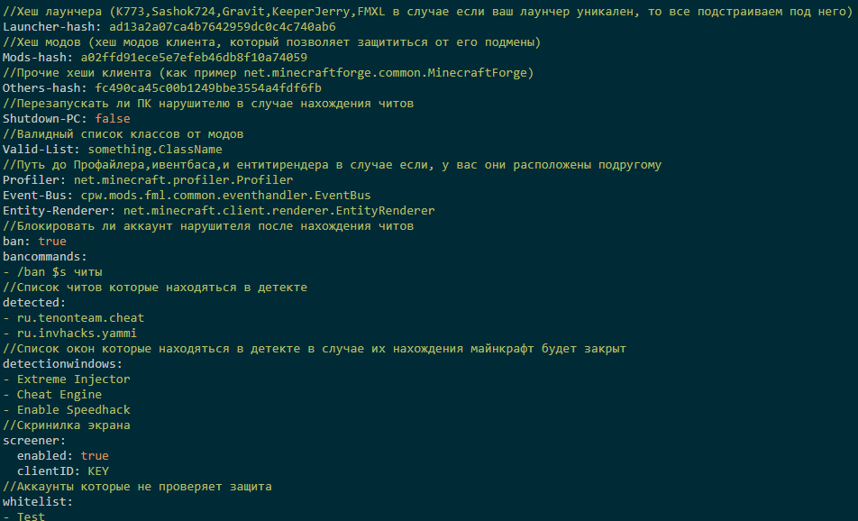

# Katxs-COMMERCIAL
Всем привет, меня зовут Константин, я занимаюсь разработкой защиты для Minecraft уже более двух лет.
На данный момент в продаже есть защита с различными возможностями нахождения внутриигровых читов, 
от самой последней версии TMaster, до самых обыденных майнкрафто читов.

Верстаю дизайны, пишу сложные механики.  
ВК - [***тык***](https://vk.com/koszotin)  
# Услуги

1. __Разработка модификаций FORGE любой сложности на версии 1.5.2 - 1.12.2.__
2. __Продажа готовых модификаций для серверов.__
3. Настройка/установка серверов 1.5.2 - 1.16.5.
4. Установка/настройка/поддержка лаунчеров (Sashok724,KeeperJerry,Gravit,K773,FMXL)
5. Установка/настройка/поддержка веб-сервисов и защита их.

>__ПРЕДОСТАВЛЯЮ ПОЛНУЮ ЗАЩИТУ: РАЗДЕЛЕНИЕ КЛИЕНТ-СЕРВЕР, ОБФУСКАЦИЯ__
__РАБОТАЮ ПО ОФОРМЛЕННОМУ, ЧЕТКОМУ ТЗ. СРОКИ И ЦЕНУ БЕЗ ТЗ НЕ ОЦЕНИВАЮ. РАБОТАЮ НЕ БЫСТРО.__

Оплату принимаю на Яндекс Деньги, Альфа банк, ВТБ. 

# Мои работы
1. __[МОД-КЛИЕНТ/CЕРВЕР-ПЛАГИН]__ (1.5.2-1.12.2) HuskyGuard, внутриигровая защита.  

